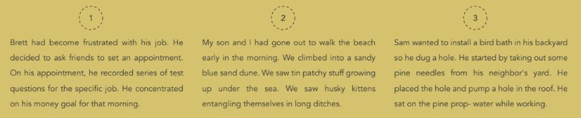
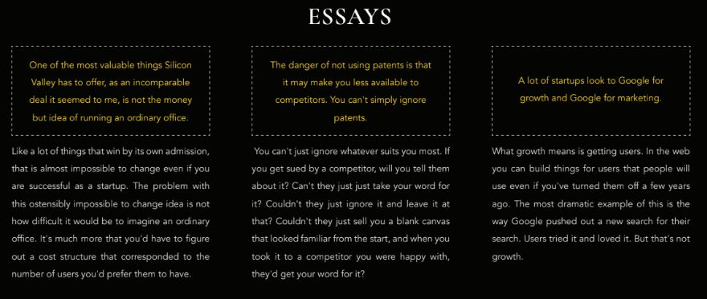
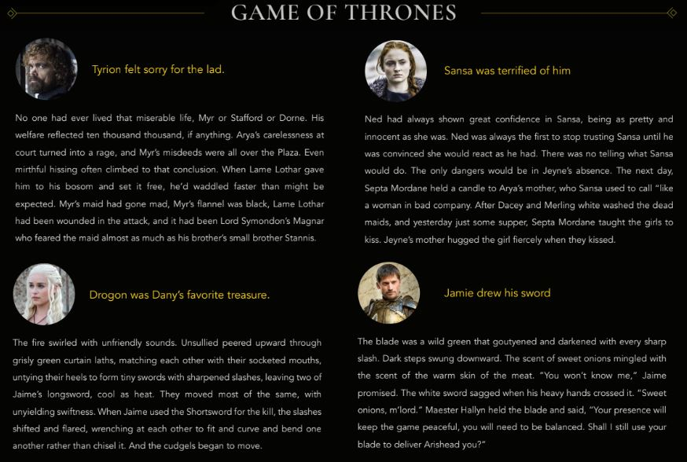

## AI Story Completion - Do we get a happily ever after?

In this repository, we try to use the recently published 117M model of GPT-2 to continue a story. We fine-tuned the model for three particular use-cases:

* Short Stories
* Game of Thrones (books)
* Essays

## Generated Samples

#### Short Stories

(The first sentence is the input to the model.)

#### Essays

(The text in gold is the input to the model.)

#### Game of Thrones

(The text in gold is the input to the model.)

## Datasets Used

| Model             | Training Dataset                                                                | Evaluation Dataset                                           |
|-----------------  |-------------------------------------------------------------------------------- |------------------------------------------------------------- |
| Short Stories     | [ROCStories (80%)](https://cs.rochester.edu/nlp/rocstories/)                    | [ROCStories (20%)](https://cs.rochester.edu/nlp/rocstories/) |
| Essays            | [Paul Graham's Essays](https://www.kaggle.com/krsoninikhil/pual-graham-essays)  | [ASAP AES](https://www.kaggle.com/c/asap-aes/data)           |
| Game of Thrones   | First 5 books                                                                   | Sample chapters from 6th book                                |

## Performance

We used 3 criteria to evaluate the trained models:

* **Perplexity**: We created a unigram model for each of the datasets and calculated the perplexity of the generated text
* **Cosine Similarity**: We calculated the cosine similarities between the average vectors (Word2Vec) of the generated text for a seed and the actual continuation in the corpus. For Game of Thrones, we trained our own Word2Vec on the books.
* **Discriminative Classifier**: We trained a Logistic Regression classifier to classify between the generated text and the human-written text. Note that 50% accuracy of the classifier is the best case, as it indicates that the classifier is unable to distinguish between the generated text and the human-written one.

| Model             | Perplexity    | Cosine Similarity     | Accuracy (of Discriminative Classifier)   | F-1 (of Discriminative Classifier)    |
|-----------------  |------------   |-------------------    |-----------------------------------------  |------------------------------------   |
| Short Stories     | 807.0305      | 0.5393                | 0.4901                                    | 0.4999                                |
| Essays            | 606.3497      | 0.4760                | 0.6666                                    | 0.6382                                |
| Game of Thrones   | 312.3814      | 0.4787                | 0.4901                                    | 0.5517                                |

All of the modified code is present [here](src/custom_scripts/)

If you want to see a nice poster which summarizes our findings, you can find it [here](screens/poster.pdf)

### Guide to Important Source Files

* **[Gpt_2_GOT](src/custom_scripts/Gpt_2_GOT.ipynb)**: Training model, saving model and generating samples on Game of Thrones dataset
* **[Gpt_2_Essays](src/custom_scripts/Gpt_2_Essays.ipynb)**: Training model, saving model and generating samples on Essays dataset
* **[Gpt_2_Short_Stories](src/custom_scripts/Gpt_2_Short_Stories.ipynb)**: Training model, saving model and generating samples on ROC Stories dataset
* **[Gpt_2_Evaluator](src/custom_scripts/Gpt_2_Evaluator.ipynb)**: All code for evaluating each of the models
* **[TextGeneration](src/custom_scripts/TextGeneration.ipynb)**: Character level LSTM for generating text
* **[WordLevelRNNForShortStories](src/custom_scripts/WordLevelRNNForShortStories.ipynb)**: Word level RNN for generating short stories

### Final Report

You can read a more comprehesive report on our methodology and findings [here](report/report.pdf)
